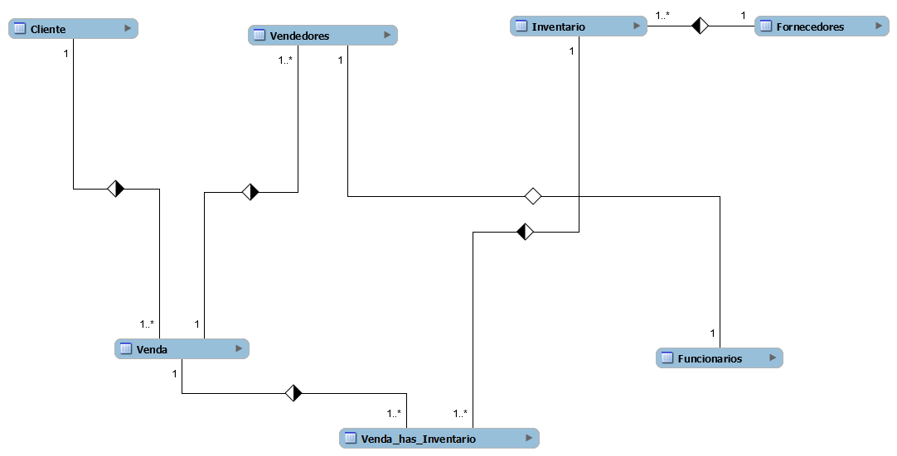
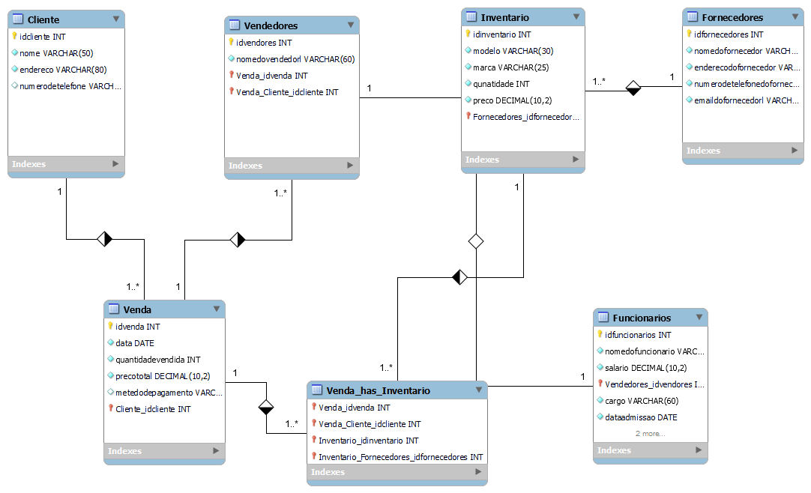

# Estudo de caso
## O casa da BikeShop 

Empresa: BikeShop

Visão Geral:
A BikeShop é uma empresa especializada na venda de bicicletas e acessórios relacionados.
Localizada em uma área urbana movimentada de Uberlândia, Minas Gerais, a empresa tem
como objetivo oferecer uma variedade de bicicletas de alta qualidade para ciclistas de todos os
níveis, desde iniciantes até ciclistas experientes e entusiastas.


Desafio:
A BikeShop está crescendo rapidamente e enfrenta desafios no gerenciamento eficiente de seu
inventário, clientes e vendas. Atualmente, eles estão registrando essas informações
manualmente ou usando planilhas eletrônicas, o que se tornou ineficiente e propenso a erros.
Eles reconhecem a necessidade de um sistema de banco de dados centralizado que possa
armazenar e gerenciar essas informações de forma mais eficaz.

Objetivos do Sistema de Banco de Dados:


Gerenciar o inventário de bicicletas e acessórios, incluindo detalhes como modelo, marca,
quantidade em estoque, preço de venda e fornecedor.
Manter um registro centralizado de clientes, incluindo informações como nome, endereço,
número de telefone, endereço de e-mail e histórico de compras.
Registrar e acompanhar as vendas de bicicletas e acessórios, incluindo detalhes como data da
venda, produtos vendidos, preço de venda, método de pagamento e vendedor responsável.
Requisitos Funcionais do Sistema de Banco de Dados:


Capacidade de adicionar, atualizar e excluir itens do inventário, bem como verificar a
disponibilidade de produtos em tempo real.
Capacidade de adicionar novos clientes, atualizar informações existentes e manter um histórico
de suas compras anteriores.
Funcionalidade para registrar novas vendas, incluindo a associação dos produtos vendidos aos
clientes correspondentes e a geração de recibos.
Recursos de segurança para proteger os dados do cliente e do inventário contra acesso não
autorizado.
Capacidade de gerar relatórios de vendas, análises de estoque e dados do cliente para ajudar
na tomada de decisões comerciais.


Abordagem Proposta:
A BikeShop planeja desenvolver um sistema de banco de dados personalizado usando
tecnologias modernas de banco de dados, como MySQL ou PostgreSQL. Eles planejam
colaborar com desenvolvedores de software especializados para projetar e implementar o
sistema de acordo com seus requisitos específicos. O sistema será acessado por funcionários
autorizados por meio de uma interface de usuário intuitiva, onde poderão realizar todas as
operações necessárias de forma eficiente.


Benefícios Esperados:

Melhoria na eficiência operacional, permitindo que a BikeShop gerencie seu inventário, clientes
e vendas de forma mais rápida e precisa.
Maior satisfação do cliente, oferecendo um serviço mais personalizado e mantendo um
histórico detalhado das interações anteriores.
Melhoria na tomada de decisões comerciais com base em relatórios e análises de dados
precisos e atualizados.
Com um sistema de banco de dados eficiente e bem projetado, a BikeShop está confiante de
que poderá atender às demandas de seus clientes de maneira mais eficaz e continuar
prosperando no mercado de bicicletas.

### Modelo Conceitual para o estudo de caso:



### Modelo Lógico do banco de dados:



### Codigo em sql

```sql
-- MySQL Workbench Forward Engineering

SET @OLD_UNIQUE_CHECKS=@@UNIQUE_CHECKS, UNIQUE_CHECKS=0;
SET @OLD_FOREIGN_KEY_CHECKS=@@FOREIGN_KEY_CHECKS, FOREIGN_KEY_CHECKS=0;
SET @OLD_SQL_MODE=@@SQL_MODE, SQL_MODE='ONLY_FULL_GROUP_BY,STRICT_TRANS_TABLES,NO_ZERO_IN_DATE,NO_ZERO_DATE,ERROR_FOR_DIVISION_BY_ZERO,NO_ENGINE_SUBSTITUTION';

-- -----------------------------------------------------
-- Schema mydb
-- -----------------------------------------------------

-- -----------------------------------------------------
-- Schema mydb
-- -----------------------------------------------------
CREATE SCHEMA IF NOT EXISTS `mydb` DEFAULT CHARACTER SET utf8 ;
SHOW WARNINGS;
USE `mydb` ;

-- -----------------------------------------------------
-- Table `mydb`.`Fornecedores`
-- -----------------------------------------------------
DROP TABLE IF EXISTS `mydb`.`Fornecedores` ;

SHOW WARNINGS;
CREATE TABLE IF NOT EXISTS `mydb`.`Fornecedores` (
  `idfornecedores` INT NOT NULL AUTO_INCREMENT,
  `nomedofornecedor` VARCHAR(60) NOT NULL,
  `enderecodofornecedor` VARCHAR(150) NOT NULL,
  `numerodetelefonedofornecedor` VARCHAR(15) NOT NULL,
  `emaildofornecedorl` VARCHAR(100) NOT NULL,
  PRIMARY KEY (`idfornecedores`),
  UNIQUE INDEX `emaildofornecedorl_UNIQUE` (`emaildofornecedorl` ASC) VISIBLE)
ENGINE = InnoDB;

SHOW WARNINGS;

-- -----------------------------------------------------
-- Table `mydb`.`Inventario`
-- -----------------------------------------------------
DROP TABLE IF EXISTS `mydb`.`Inventario` ;

SHOW WARNINGS;
CREATE TABLE IF NOT EXISTS `mydb`.`Inventario` (
  `idinventario` INT NOT NULL AUTO_INCREMENT,
  `modelo` VARCHAR(30) NOT NULL,
  `marca` VARCHAR(25) NOT NULL,
  `qunatidade` INT NOT NULL,
  `preco` DECIMAL(10,2) NOT NULL,
  `Fornecedores_idfornecedores` INT NOT NULL,
  PRIMARY KEY (`idinventario`, `Fornecedores_idfornecedores`),
  INDEX `fk_Inventario_Fornecedores_idx` (`Fornecedores_idfornecedores` ASC) VISIBLE,
  CONSTRAINT `fk_Inventario_Fornecedores`
    FOREIGN KEY (`Fornecedores_idfornecedores`)
    REFERENCES `mydb`.`Fornecedores` (`idfornecedores`)
    ON DELETE NO ACTION
    ON UPDATE NO ACTION)
ENGINE = InnoDB;

SHOW WARNINGS;

-- -----------------------------------------------------
-- Table `mydb`.`Cliente`
-- -----------------------------------------------------
DROP TABLE IF EXISTS `mydb`.`Cliente` ;

SHOW WARNINGS;
CREATE TABLE IF NOT EXISTS `mydb`.`Cliente` (
  `idcliente` INT NOT NULL AUTO_INCREMENT,
  `nome` VARCHAR(50) NOT NULL,
  `endereco` VARCHAR(80) NOT NULL,
  `numerodetelefone` VARCHAR(75) NULL,
  PRIMARY KEY (`idcliente`))
ENGINE = InnoDB;

SHOW WARNINGS;

-- -----------------------------------------------------
-- Table `mydb`.`Venda`
-- -----------------------------------------------------
DROP TABLE IF EXISTS `mydb`.`Venda` ;

SHOW WARNINGS;
CREATE TABLE IF NOT EXISTS `mydb`.`Venda` (
  `idvenda` INT NOT NULL AUTO_INCREMENT,
  `data` DATE NOT NULL,
  `quantidadevendida` INT NOT NULL,
  `precototal` DECIMAL(10,2) NOT NULL,
  `metedodepagamento` VARCHAR(45) NULL,
  `Cliente_idcliente` INT NOT NULL,
  PRIMARY KEY (`idvenda`, `Cliente_idcliente`),
  INDEX `fk_Venda_Cliente1_idx` (`Cliente_idcliente` ASC) VISIBLE,
  CONSTRAINT `fk_Venda_Cliente1`
    FOREIGN KEY (`Cliente_idcliente`)
    REFERENCES `mydb`.`Cliente` (`idcliente`)
    ON DELETE NO ACTION
    ON UPDATE NO ACTION)
ENGINE = InnoDB;

SHOW WARNINGS;

-- -----------------------------------------------------
-- Table `mydb`.`Vendedores`
-- -----------------------------------------------------
DROP TABLE IF EXISTS `mydb`.`Vendedores` ;

SHOW WARNINGS;
CREATE TABLE IF NOT EXISTS `mydb`.`Vendedores` (
  `idvendores` INT NOT NULL AUTO_INCREMENT,
  `nomedovendedorl` VARCHAR(60) NOT NULL,
  `Venda_idvenda` INT NOT NULL,
  `Venda_Cliente_idcliente` INT NOT NULL,
  PRIMARY KEY (`idvendores`, `Venda_idvenda`, `Venda_Cliente_idcliente`),
  INDEX `fk_Vendedores_Venda1_idx` (`Venda_idvenda` ASC, `Venda_Cliente_idcliente` ASC) VISIBLE,
  CONSTRAINT `fk_Vendedores_Venda1`
    FOREIGN KEY (`Venda_idvenda` , `Venda_Cliente_idcliente`)
    REFERENCES `mydb`.`Venda` (`idvenda` , `Cliente_idcliente`)
    ON DELETE NO ACTION
    ON UPDATE NO ACTION)
ENGINE = InnoDB;

SHOW WARNINGS;

-- -----------------------------------------------------
-- Table `mydb`.`Funcionarios`
-- -----------------------------------------------------
DROP TABLE IF EXISTS `mydb`.`Funcionarios` ;

SHOW WARNINGS;
CREATE TABLE IF NOT EXISTS `mydb`.`Funcionarios` (
  `idfuncionarios` INT NOT NULL AUTO_INCREMENT,
  `nomedofuncionario` VARCHAR(70) NOT NULL,
  `salario` DECIMAL(10,2) NOT NULL,
  `Vendedores_idvendores` INT NOT NULL,
  `cargo` VARCHAR(60) NOT NULL,
  `dataadmissao` DATE NOT NULL,
  `Vendedores_Venda_idvenda` INT NOT NULL,
  `Vendedores_Venda_Cliente_idcliente` INT NOT NULL,
  PRIMARY KEY (`idfuncionarios`, `Vendedores_idvendores`, `Vendedores_Venda_idvenda`, `Vendedores_Venda_Cliente_idcliente`),
  INDEX `fk_Funcionarios_Vendedores1_idx` (`Vendedores_idvendores` ASC, `Vendedores_Venda_idvenda` ASC, `Vendedores_Venda_Cliente_idcliente` ASC) VISIBLE,
  CONSTRAINT `fk_Funcionarios_Vendedores1`
    FOREIGN KEY (`Vendedores_idvendores` , `Vendedores_Venda_idvenda` , `Vendedores_Venda_Cliente_idcliente`)
    REFERENCES `mydb`.`Vendedores` (`idvendores` , `Venda_idvenda` , `Venda_Cliente_idcliente`)
    ON DELETE NO ACTION
    ON UPDATE NO ACTION)
ENGINE = InnoDB;

SHOW WARNINGS;

-- -----------------------------------------------------
-- Table `mydb`.`Venda_has_Inventario`
-- -----------------------------------------------------
DROP TABLE IF EXISTS `mydb`.`Venda_has_Inventario` ;

SHOW WARNINGS;
CREATE TABLE IF NOT EXISTS `mydb`.`Venda_has_Inventario` (
  `Venda_idvenda` INT NOT NULL,
  `Venda_Cliente_idcliente` INT NOT NULL,
  `Inventario_idinventario` INT NOT NULL,
  `Inventario_Fornecedores_idfornecedores` INT NOT NULL,
  PRIMARY KEY (`Venda_idvenda`, `Venda_Cliente_idcliente`, `Inventario_idinventario`, `Inventario_Fornecedores_idfornecedores`),
  INDEX `fk_Venda_has_Inventario_Inventario1_idx` (`Inventario_idinventario` ASC, `Inventario_Fornecedores_idfornecedores` ASC) VISIBLE,
  INDEX `fk_Venda_has_Inventario_Venda1_idx` (`Venda_idvenda` ASC, `Venda_Cliente_idcliente` ASC) VISIBLE,
  CONSTRAINT `fk_Venda_has_Inventario_Venda1`
    FOREIGN KEY (`Venda_idvenda` , `Venda_Cliente_idcliente`)
    REFERENCES `mydb`.`Venda` (`idvenda` , `Cliente_idcliente`)
    ON DELETE NO ACTION
    ON UPDATE NO ACTION,
  CONSTRAINT `fk_Venda_has_Inventario_Inventario1`
    FOREIGN KEY (`Inventario_idinventario` , `Inventario_Fornecedores_idfornecedores`)
    REFERENCES `mydb`.`Inventario` (`idinventario` , `Fornecedores_idfornecedores`)
    ON DELETE NO ACTION
    ON UPDATE NO ACTION)
ENGINE = InnoDB;

SHOW WARNINGS;

SET SQL_MODE=@OLD_SQL_MODE;
SET FOREIGN_KEY_CHECKS=@OLD_FOREIGN_KEY_CHECKS;
SET UNIQUE_CHECKS=@OLD_UNIQUE_CHECKS;
```